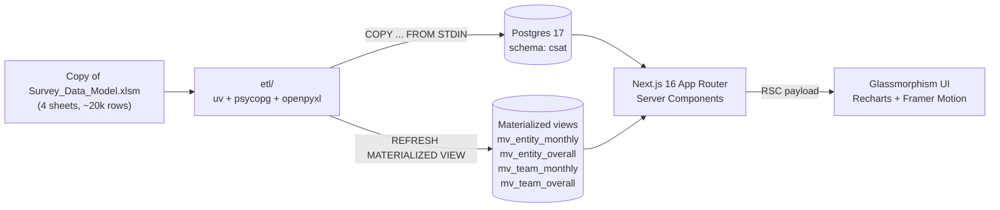
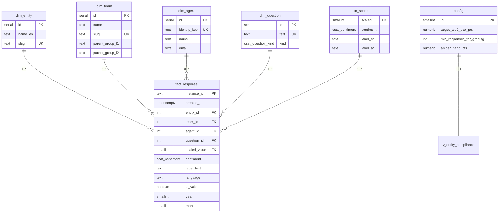
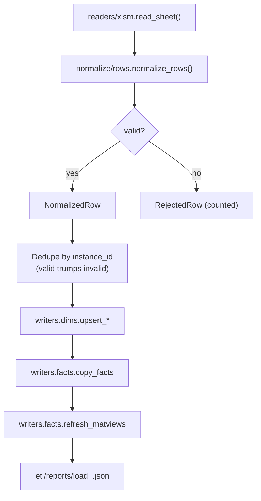
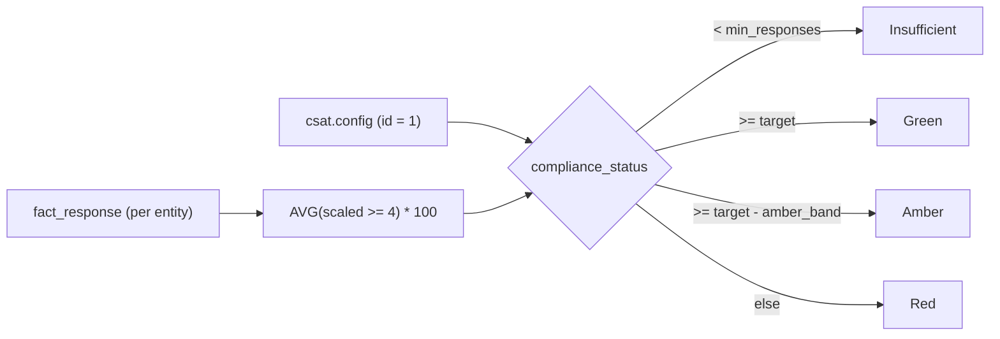

# Architecture

## Data flow

## Schema

All objects live in the `csat` schema.

`fact_response_invalid` mirrors `fact_response` (`LIKE ... INCLUDING ALL`)
and stores rows from the workbook's "Invalid" sheets so the data is preserved
without polluting compliance metrics.

## ETL pipeline

Each `instance_id` ends up in exactly one fact table — if it appears in both a
valid and an invalid sheet, the valid row wins.

## Frontend

- **Routes**: `/`, `/entities`, `/entities/[slug]`, `/teams`, `/teams/[slug]`,
  `/compare`, `/settings`.
- **State**: filter bar state is encoded in the URL via `nuqs` so links share
  context. Server components decode the URL with `filterCache.parse` and pass
  the resulting `SurveyFilters` into query helpers.
- **Database access**: a single `postgres.js` client lives in
  `src/lib/db/client.ts`. Query helpers in `src/lib/queries/*` return typed
  shapes (no leaking `Row[]` into pages).
- **Charts**: thin Recharts wrappers in `src/components/charts/` with shared
  tooltip styling and theme-aware colors. All chart props are
  serialisable (no function props passed from Server → Client Components).

## Compliance model

Updating `csat.config` from the `/settings` page revalidates every cached
server-component query and re-paints the whole UI on next navigation.
